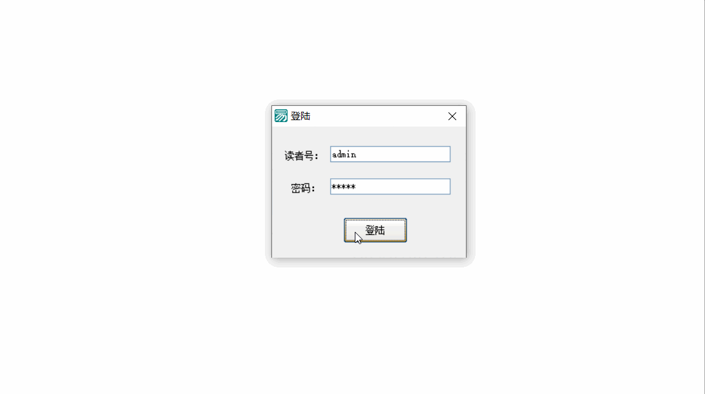
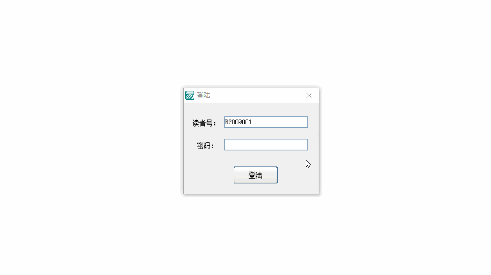
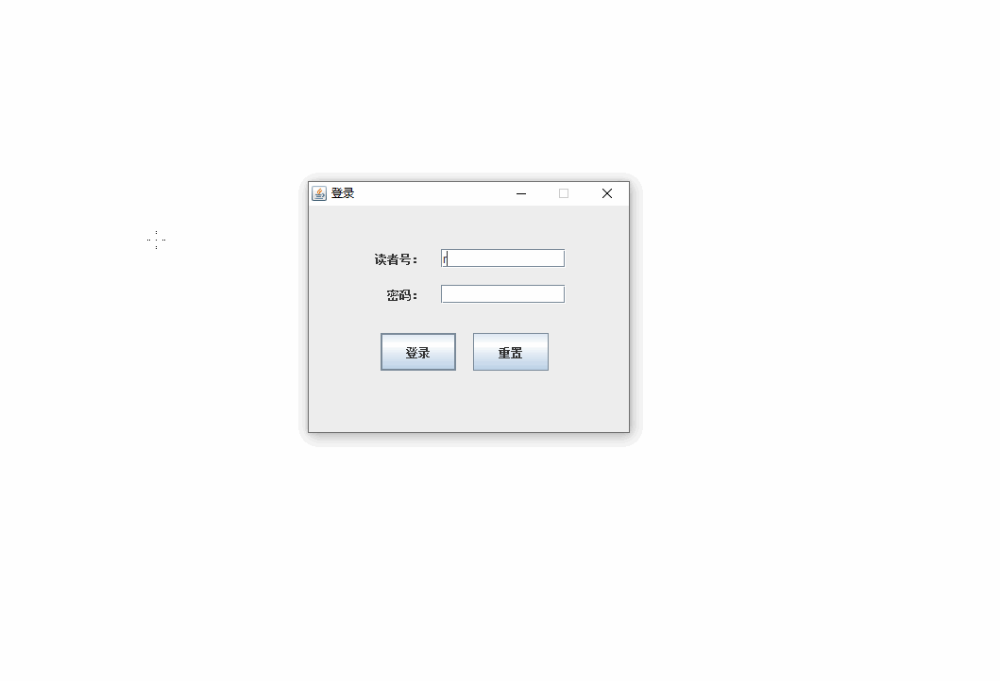
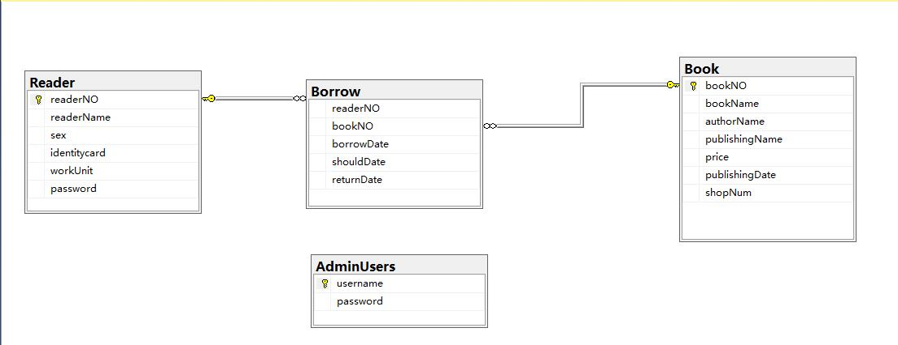

# 图书借阅管理系统
>#### 一个基于Java Swing和SQL SERVER的图书借阅管理系统。
>#### 一个基于易语言写的Demo
# 项目简介
该系统有两个角色，一个是普通读者，一个是管理员。

普通读者拥有借书，还书，续期，修改密码，筛选图书等功能

管理员具有管理书籍与读者信息的功能，包括
 - 添加书籍（入库）
 - 修改书籍信息
 - 删除书籍（出库）
 - 添加读者
 - 修改读者信息
 - 删除读者
 - 修改密码
# 项目分工与项目要求
[项目分工](/项目分工.docx)

[项目要求](/Java实验七-GUI+JDBC数据库编程.ppt)
# 开发状态
使用Github Desktop clone项目，然后手动导入项目到Netbeans继续开发。
项目目前已完成

# 备注
Demo文件夹下有个Demo.exe和Demo.e的易语言文件，仅仅有界面显示，可以参考画Java Swing界面。

其中Demo_stable.exe是易语言写的实现了部分功能的Demo，由于所使用的数据库表结构为旧版，请使用[tags v0.1](https://github.com/lyz05/Book-borrowing-management-system/tree/v0.1)中的数据库标本建表。


# 运行环境
数据库使用学校内网的台式机10.0.78.30或者使用下面给出的数据库脚本自建数据库

在装有jre的GUI环境下直接打开dist下的[Ch09.jar](dist/Ch09.jar)

或者使用命令行方案
```
git clone https://github.com/lyz05/Book-borrowing-management-system.git
cd Book-borrowing-management-system\dist
java -jar "Ch09.jar" 
```
# 数据库脚本
[数据库脚本链接](Demo/SQLQuery.sql)
# 易语言Demo截图


# JAVA软件截图


# 数据库关系图
